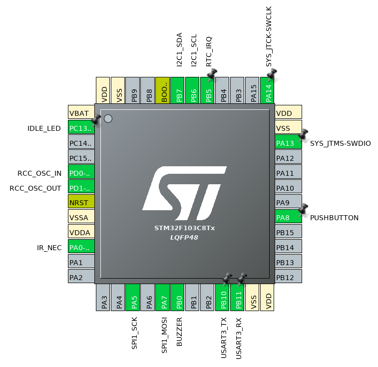

Programmable LED strip mood lamp and clock
==========================================

Features
--------

 - display consisting of 1 meter SK6812 LED strip (control code based on [WS2812B_STM32_Libmaple](https://github.com/rogerclarkmelbourne/WS2812B_STM32_Libmaple))
 - linear clock
 - alarm with RTTTL Nokia ringtones (main 'play' function taken from [here](https://github.com/granadaxronos/120-SONG_NOKIA_RTTTL_RINGTONE_PLAYER_FOR_ARDUINO_UNO))
 - IR remote control (NEC decoder inspired by [here](https://github.com/albertyeh/STM32_NEC_Decode))
 - sunrise simulator
 - white light lamp
 - fire effect (borrowed from [WS2812FX](https://github.com/kitesurfer1404/WS2812FX))
 - plasma effect (parts borrowed from [FastLED](https://github.com/FastLED/FastLED))

Real-world example demonstrating superiority of communicating state machine approach to embedded system design.
Without an preemptive OS it's possible to achieve a high degree of concurrency while maintaining footprint only slightly
larger than required by bare-metal code. Code structure is isomorphic to UML state diagrams and therefore self documenting.
With the traditional implicit global state sharing approach I wouldn't even think of implementing a system like this, specially
in limited free time I have.

STM32F103C8 pinout:

